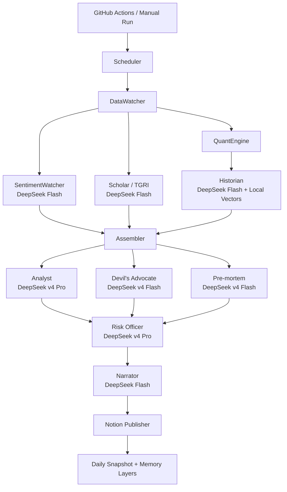

# Daily Intelligence Brief v10.1

Daily Intelligence Brief（DIB）是一個自動化的跨資產情報引擎。它每天蒐集市場、總經、地緣政治、新聞輿情與既有 thesis，經過多代理人交叉辯論後，產出一份可追溯、可反駁、可累積記憶的投資情報簡報，並發布到 Notion。

它不是「把行情整理成摘要」的工具，而是把市場資料轉成一條可檢查的因果推論鏈。

## 目前能力

| 面向 | 說明 |
| --- | --- |
| 每日自動化 | GitHub Actions 每天 06:00（Asia/Taipei）自動執行，也可手動觸發 |
| 多代理人推論 | Analyst、Devil's Advocate、Pre-mortem、Risk Officer、Narrator 分工協作 |
| 模型路由 | 全部 LLM 任務統一由 DeepSeek v4 Pro / Flash 負責 |
| 高推理分析 | 核心分析與風險裁決使用 DeepSeek v4 Pro，thinking enabled，reasoning effort max |
| 長期記憶 | 保存每日快照、推論紀錄、歷史類比、active thesis 與校準結果 |
| 不可變研究帳本 | GitHub snapshot 保存 claims、evidence、verdicts、watchboard、causal graph、quality score |
| 機構級 Notion | Notion 只呈現高密度閱讀介面：機構快照、因果圖、反證、回測、配置含義 |
| Watchboard 回測 | 昨日「要觀察什麼」會在今日被裁決，不讓日報變成一次性漂亮文章 |
| 品質閘門 | 發布前檢查章節完整性、數字錨定、反證整合、機器代碼外洩與 watchboard 厚度 |
| 繁體中文輸出 | 所有 LLM prompt 加入最高優先層級的繁體中文政策，禁止簡體中文輸出 |
| 失敗保護 | JSON 修復、非空 fallback、資料品質標記、執行逾時上限與 log 降噪 |

## 系統哲學

DIB 的核心資產不是文字報告，而是推論歷史。每一天的觀點、被挑戰的假設、事後驗證結果和 thesis 狀態，都會被保存下來，讓系統逐步學會自己在哪些市場環境容易判斷錯。

這一版的技術選擇是：**不要相信 narrator 自己會永遠守規矩**。LLM 負責推理與文字，但 deterministic code 負責研究帳本、因果圖、watchboard 回測、報告契約修補與品質評分。DIB 的目標是讓每個判斷背後都有可追溯的證據、反證、裁決與隔日檢查。

系統以三個思想框架作為敘事骨架：

| 思想家 | 在系統中的角色 | 方法 |
| --- | --- | --- |
| Paul Krugman | 主線故事、配置羅盤 | 先立再破：共識、忽略的機制、一般均衡反轉 |
| Amartya Sen | Thesis 邊界與地緣政治戰術層 | 先定義問題，再判斷選項 |
| Daron Acemoglu | 地緣政治與制度約束 | 路徑依賴：今日選擇限制明日選項 |

## Codex Upgrade Notes

| 文件 | 用途 |
| --- | --- |
| [`docs/RED_TEAM_REVIEW_2026-05-27.md`](docs/RED_TEAM_REVIEW_2026-05-27.md) | 使用真實 snapshot 做的主線故事判斷密度紅隊評分 |

### 技術選擇

| 選擇 | 理由 |
| --- | --- |
| DeepSeek-only model routing | 移除 Gemini 與 LINE 分支後，GitHub Actions、env secrets、成本追蹤與故障排查都更簡單 |
| GitHub as immutable ledger | 每日 JSON 保存推論鏈、裁決、品質分數、watchboard 與 outcome path，方便 diff、審計與回測 |
| Notion as reading interface | Notion 不保存所有內部噪音，只呈現機構級 decision memo 與讀者需要看的高密度結論 |
| Editorial contract before writing | narrator 動筆前先由程式生成真正改變、主導機制、弱資料折扣、反證與配置動作的硬性藍圖 |
| Deterministic contract repair | 若 narrator 寫歪，`report_quality.repair_report_contract` 會補強主線開頭、機制段、弱資料折扣、配置動作與必要章節 |
| Watchboard DSL | `升破 20 且 SPX 同步轉弱`、`重新站上 100 或跌破 88`、`連續兩日轉為大額賣超` 可被隔日資料裁決 |
| Quality gate before publish | 發布前檢查 missing section、主線開頭、機制句密度、弱資料折扣、position-sizing 語言、watchboard-first 與反證整合 |

### 2026-05-27 Red-Team Baseline

最新可用真實 snapshot 的人工紅隊分數：**76 / 100**。

評語：已是可發布的研究帳本，但還不是橋水級 daily observation。強項是有真實核心張力、可審計推論鏈與風險官修正；弱點是第一屏不夠像 decision memo、cached/stale data 的信心折扣不夠顯性、配置含義還可以更接近 position-sizing 語言。

## 架構概覽



### Model Routing

| 任務 | 模型 | 搜尋 | 用途 |
| --- | --- | --- | --- |
| Analyst | `deepseek-v4-pro` | 否 | 核心市場 regime、推論鏈、配置羅盤 |
| Risk Officer | `deepseek-v4-pro` | 否 | 仲裁 Analyst、DA、Pre-mortem 的衝突 |
| Historian | `deepseek-v4-flash` | 否 | 歷史類比敘事與相似場景解讀 |
| Devil's Advocate | `deepseek-v4-flash` | 否 | 故意攻擊主論點，找確認偏誤 |
| Pre-mortem | `deepseek-v4-flash` | 否 | 替 active thesis 生成失敗情境 |
| Narrator | `deepseek-v4-flash` | 是 | 把裁決後的分析寫成 Notion 報告 |
| Sentiment Watcher | `deepseek-v4-flash` | 是 | 每日輿情與事件脈絡摘要 |
| Scholar / TGRI | `deepseek-v4-flash` | 是 | 台海與周邊地緣政治風險 |
| Thesis Reviewer | `deepseek-v4-flash` | 是 | 新 thesis 審核與 active thesis 更新 |

DeepSeek 的請求會帶入：

```json
{
  "thinking": {
    "type": "enabled"
  },
  "reasoning_effort": "max"
}
```

## 每日 Pipeline

1. `Scheduler`：抓取總經事件與財經日曆，標記今天是否有重要資料公布。
2. `DataWatcher`：抓取跨資產資料，包括股、債、匯、商品、台灣數據、能源與景氣指標。
3. `SentimentWatcher`：使用 DeepSeek Flash 摘要新聞與輿情事件脈絡。
4. `QuantEngine`：計算 regime、分數卡、張力指標與技術狀態。
5. `Historian`：從向量記憶中找相似歷史日，補上歷史類比。
6. `TGRI Auto-Scorer`：更新台灣地緣政治風險指標。
7. `Assembler`：整理所有資料包、缺口、品質標記與 token allocation。
8. `Analyst`：產生第一版因果推論鏈與配置羅盤。
9. `Devil's Advocate`：只看資料包，不看 Analyst 推論，獨立攻擊假設。
10. `Pre-mortem`：推演 active thesis 最可能失敗的方式。
11. `Risk Officer`：裁決衝突、調整信心、保留或推翻結論。
12. `Narrator`：把最終結論寫成可讀的繁體中文報告。
13. `Notion Publisher`：發布到 Notion，並保存每日快照與記憶更新。

## 資料與記憶

| 位置 | 內容 |
| --- | --- |
| `memory/daily_snapshots/` | 每日完整輸出與 Notion URL |
| `daily snapshot: research_ledger` | 不可變研究帳本欄位：推論、裁決、觀察清單、因果圖與品質分數 |
| `memory/weekly_snapshots/` | 週度回顧輸出 |
| `memory/timeseries/` | regime、TGRI、scorecard、inference history |
| `memory/theses/active/` | 目前仍在追蹤的市場 thesis |
| `memory/theses/proposed/` | 待審核的新 thesis |
| `memory/theses/closed/` | 已結案或失效的 thesis |
| `memory/vectors/` | 歷史快照向量索引 |
| `memory/system/` | 資料健康狀態與缺口紀錄 |
| `memory/cache/` | 外部資料快取 |

資料品質會以來源分級與日期落差標記：

| 標記 | 意義 |
| --- | --- |
| `confirmed` | 官方或穩定來源，資料為最新 |
| `cached` | 來源可信，但沿用近期快取 |
| `stale` | 資料過舊，只能輔助判斷 |
| `estimated` | 社群、不穩定來源或 proxy 資料 |
| `MISSING_DATA` | 來源失敗且無合理替代 |

## 快速開始

### 1. 安裝

```bash
python -m venv .venv
source .venv/bin/activate
python -m pip install --upgrade pip
python -m pip install -r requirements.txt
```

Windows PowerShell：

```powershell
python -m venv .venv
.\.venv\Scripts\Activate.ps1
python -m pip install --upgrade pip
python -m pip install -r requirements.txt
```

### 2. 設定環境變數

本機可建立 `.env`：

```bash
DEEPSEEK_API_KEY=...
NOTION_API_KEY=...
NOTION_DATABASE_ID=...
FRED_API_KEY=...
FINNHUB_API_KEY=...
EIA_API_KEY=...
```

GitHub Actions 則放在 repository secrets。必要 secrets：

| Secret | 用途 |
| --- | --- |
| `DEEPSEEK_API_KEY` | DeepSeek 分析、風險裁決與 fast agents |
| `NOTION_API_KEY` | Notion 發布 |
| `NOTION_DATABASE_ID` | Notion 目標資料庫 |
| `FRED_API_KEY` | 美國總經資料 |
| `FINNHUB_API_KEY` | 財經日曆與部分市場資料 |
| `EIA_API_KEY` | 原油與能源資料 |

選用 secrets：

| Secret | 用途 |
| --- | --- |
| `ALPHA_VANTAGE_API_KEY` | 補充市場資料來源 |
| `HF_TOKEN` | Hugging Face 模型下載額度與提示降噪 |

查看 GitHub repo 目前有哪些 secrets：

```bash
gh secret list --repo jechiu16/daily-intelligence-brief-v10
```

新增或更新 secret：

```bash
gh secret set DEEPSEEK_API_KEY --repo jechiu16/daily-intelligence-brief-v10
```

### 3. 執行

```bash
python -m src.orchestrator
```

忽略今日已存在快照並強制重跑：

```bash
python -m src.orchestrator --force
```

週度回顧：

```bash
python -m src.weekly_orchestrator
```

## GitHub Actions

Workflows：
- `.github/workflows/daily-brief.yml`：手動觸發
- `.github/workflows/daily-brief-scheduled.yml`：每天自動觸發

| 設定 | 值 |
| --- | --- |
| 排程 | 每天 06:00 Asia/Taipei |
| UTC cron | `0 22 * * *` |
| 手動執行 | GitHub Actions 頁面中的 `Daily Intelligence Brief - Manual` |
| 手動模型 profile | `balanced`（預設）或 `flash-only` |
| Job timeout | 60 分鐘 |
| Pipeline timeout | `timeout 55m python -m src.orchestrator --force` |
| 自動提交 | `memory/` 有變更時由 `github-actions[bot]` commit 回 repo |

排程 workflow 預設的模型與搜尋控制：

```yaml
DEEPSEEK_MODEL: deepseek-v4-pro
DEEPSEEK_FAST_MODEL: deepseek-v4-flash
DEEPSEEK_THINKING: enabled
DEEPSEEK_REASONING_EFFORT: max
NARRATOR_MODEL: deepseek-v4-flash
SEARCH_SUMMARY_MODEL: deepseek-v4-flash
THESIS_REVIEW_MODEL: deepseek-v4-flash
ENABLE_DAILY_CONTEXT_SCAN: "true"
ENABLE_PERIPHERY_CONTEXT: "true"
THESIS_REVIEW_LIMIT: "1"
ACTIVE_THESIS_UPDATE_LIMIT: "1"
```

常用檢查指令：

```bash
gh workflow run daily-brief.yml -f model_profile=balanced
gh workflow run daily-brief.yml -f model_profile=flash-only
gh run list --workflow daily-brief-scheduled.yml --limit 5
gh run view --log
```

在 Windows PowerShell 篩選 warning / error：

```powershell
gh run view --log |
  Select-String -Pattern "ERROR|WARNING|CRITICAL|429|timeout|MISSING_DATA|JSON|model|not found" -CaseSensitive:$false
```

## Thesis 管理

列出 thesis：

```bash
python tools/thesis_cli.py list
```

建立 thesis：

```bash
python tools/thesis_cli.py create --title "Fed 年內降息兩次" --deadline 2026-12-31
```

關閉 thesis：

```bash
python tools/thesis_cli.py close T001 --reason "數據否定"
```

手動更新 TGRI 輸入：

```bash
python tools/update_manual.py adiz_intrusions 3
python tools/update_manual.py pla_activity_level 2
```

## Reliability Notes

近期的穩定性設計：

| 問題 | 現在的處理 |
| --- | --- |
| LLM JSON 格式不完整 | 會嘗試移除 trailing comma、控制字元並重新解析 |
| Narrator 失敗造成 Notion 空頁 | 會產生 deterministic fallback report，確保輸出不為空 |
| Analyst 解析失敗 | fallback 會根據資料包生成 regime、張力與配置提示 |
| Devil's Advocate / Pre-mortem JSON 失敗 | fallback 仍會產生攻擊點與失敗情境 |
| Finnhub calendar impact 型別不穩 | 統一轉成分數再比較 |
| NDC 台灣領先指標 403 | 降級成 TWII proxy，並以 info 等級記錄 |
| QuantEngine NaN warning 過多 | 聚合成單行摘要，避免 log 被洗版 |
| GitHub Actions runtime warning | workflow 已升級 `actions/checkout@v6`、`actions/setup-python@v6`，並保留 Node 24 強制旗標 |
| 簡體中文混入 | prompt 層加入最高優先的繁體中文政策 |
| 日報品質漂移 | `report_quality` 會在發布前檢查章節完整性、數字錨定、反證整合與 24-72 小時觀察清單 |

## Troubleshooting

| 現象 | 檢查方向 |
| --- | --- |
| GitHub Action 很久 | DeepSeek v4 Pro max effort 本來會慢，先看是否卡在 Analyst 或 Risk Officer |
| DeepSeek 429 | 降低 `THESIS_REVIEW_LIMIT`，或暫時關閉部分 context scan |
| DeepSeek model not found | 確認 `DEEPSEEK_MODEL` / `DEEPSEEK_FAST_MODEL` 為可用模型 |
| Notion 沒有輸出 | 確認 `NOTION_API_KEY`、`NOTION_DATABASE_ID`、資料庫權限 |
| 資料大量 `MISSING_DATA` | 檢查 FRED、EIA、Finnhub、yfinance 網路與 API 額度 |
| repo push 被拒絕 | GitHub Action 可能剛提交 `memory/`，先 `git pull --rebase origin main` |

## 專案結構

```text
.
├── .github/workflows/daily-brief.yml
├── src/
│   ├── orchestrator.py
│   ├── config.py
│   ├── deepseek_client.py
│   ├── data_watcher.py
│   ├── quant_engine.py
│   ├── sentiment_watcher.py
│   ├── scholar.py
│   ├── historian.py
│   ├── assembler.py
│   ├── notion_publisher.py
│   ├── prompts/
│   │   ├── language_policy.py
│   │   └── *_system.py
│   └── agents/
│       ├── analyst.py
│       ├── devils_advocate.py
│       ├── premortem.py
│       ├── risk_officer.py
│       ├── narrator.py
│       └── thesis_reviewer.py
├── memory/
│   ├── daily_snapshots/
│   ├── weekly_snapshots/
│   ├── theses/
│   ├── timeseries/
│   ├── vectors/
│   └── system/
├── tools/
│   ├── thesis_cli.py
│   └── update_manual.py
├── tests/
└── requirements.txt
```

## 開發檢查

```bash
python -m compileall src
pytest -q
```

README Markdown 基本檢查：

```bash
git diff --check README.md
```

## 狀態摘要

DIB v10.1 目前的定位是：DeepSeek 負責全部推理、摘要與敘事，GitHub Actions 負責每日自動化，Notion 負責輸出，`memory/` 負責讓系統記住自己的判斷歷史。整個系統的目標，是把每日市場雜訊壓縮成一條可以被追蹤、被反駁、被更新的推論鏈。
